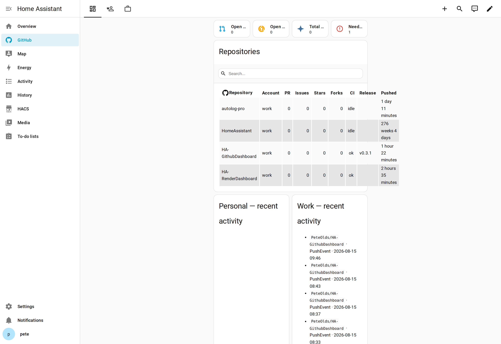
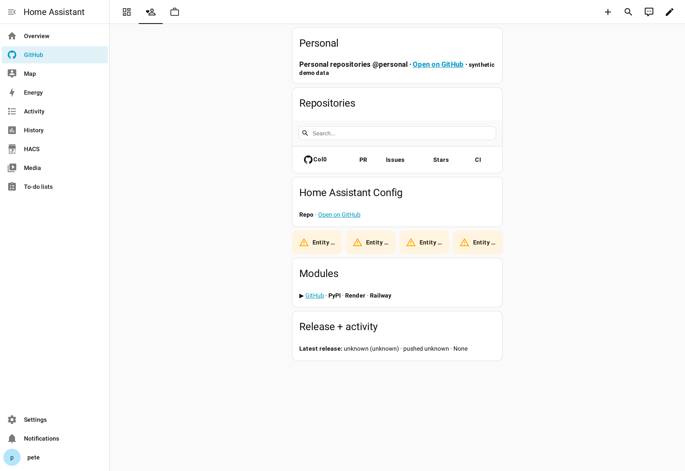
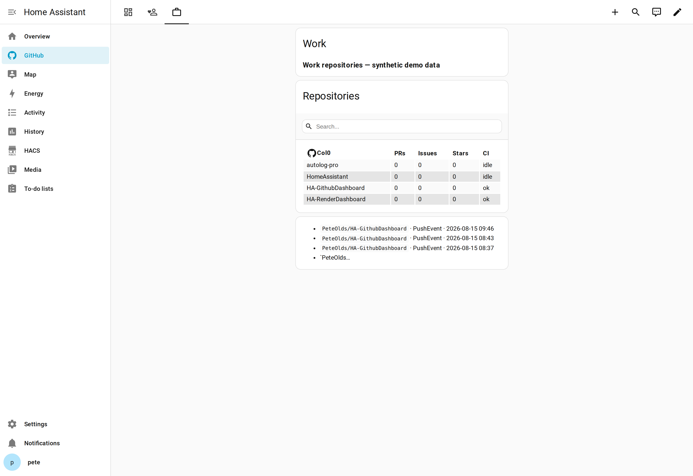

# GitHub dashboard (Home Assistant)

A native Home Assistant (Lovelace) dashboard that shows a read-only overview of
your GitHub repositories across **multiple accounts** and **multiple projects**,
with a tap through to GitHub on every identifier.

This is the companion deliverable to the `devops_bridge` integration in this
repo. It is authored in a private Obsidian vault; the files here are the
published copy. See `PRODUCT.md`/`DESIGN.md` (vault-only) for the product truth
and visual contract, and the YAML comments in `GithubDashboard.yaml` for the
consumption contract.

## What you get

Three views, rendered from a live test instance (the dev box, with the
`devops_bridge` integration feeding it):

**Overview** — the whole portfolio on one screen. Tile row of the `sensor.github_*`
aggregates (open PRs, open issues, total stars, needs-attention count), then one
flex-table registry row per repository (repository, account, PRs, issues, stars,
forks, CI, latest release, last push), plus per-account activity feeds.

**Personal** — a single-account view: same tile row plus a condensed table
(repository, PRs, issues, stars, CI) for that account's repos, with the account's
recent-activity feed underneath.

**Work** — the same single-account layout, on the `Work` account, showing the
per-repo detail stacks (releases, modules, activity) below the table.

> Screenshots were captured from the live dev instance, so they show real
> repositories from the accounts configured on that box. The aggregate tiles and
> any `<!-- synthetic -->`-marked entities are placeholders until the integration
> produces real data.

### Cards used

The whole dashboard uses only **native HA cards plus one HACS card**:

| Card | Type | Where |
|---|---|---|
| `tile` | Native | Overview/account tile rows (aggregates, attention) |
| `grid` | Native | The tile-row containers |
| `custom:flex-table-card` | HACS (the only add-on) | The per-repo registries |
| `markdown` | Native | Per-repo detail stacks, activity feeds, headers |
| `vertical-stack` / `horizontal-stack` | Native | Layout containers |

Nothing else is required — no additional GitHub cards (`github-flexi-card`,
`github-entity-row`, `github-card`) are used.

## Install

1. **Install the one new HACS card** (the only non-native component):
   - HACS → Frontend → search `flex-table` → install `custom-cards/flex-table-card`.
   - This is what registers the card's resource. In a **storage-mode** dashboard
     the `resources:` block at the top of `GithubDashboard.yaml` is **ignored** —
     resources are managed by HA separately (HACS registers them for you when you
     install the card). If you skip HACS, add the resource manually via Dashboard
     → **…** → **Resources** → URL `/local/community/flex-table-card/flex-table-card.js`.
2. **Add the Overview template sensors** — the `sensor.github_*` aggregates are
   HA template sensors, not integration entities. Add
   `template: !include TemplateSensors.yaml` to your
   `configuration.yaml` (the file's top level is the `template:` list, so the
   include drops it straight under the `template:` option).
3. **Create the dashboard**
   - Settings → Dashboards → **+ ADD DASHBOARD** → New dashboard from scratch.
   - In the new dashboard, click **…** (three dots) → **Raw configuration editor**.
   - Paste the `title:` + `views:` portion of `GithubDashboard.yaml`
     (everything from `title: GitHub` onward, skipping the `resources:` block at
     the top — that block is only for YAML-mode dashboards, where it would live
     in the frontend config instead).
4. Install the integration (`custom_components/devops_bridge/`) and add it via
   Settings → Devices & services → **GitHub Repo Monitor**.

> The dashboard will show placeholder tiles until the integration produces the
> `sensor.*`/`binary_sensor.*` entities named in the YAML comments.

## Personal access token (one per account)

The integration needs a **fine-grained, read-only** GitHub PAT. It is stored in
the HA config entry and never logged or committed.

### Create the token

1. GitHub → **Settings** → **Developer settings** (bottom of the left sidebar)
   → **Personal access tokens** → **Fine-grained tokens** → **Generate new
   token**.
2. **Token name:** e.g. `Home Assistant (Work)`.
3. **Expiration:** set something short (e.g. 90 days). The token is the only
   credential; rotate it before expiry.
4. **Repository access:** select **Only select repositories** and choose exactly
   the repos you want to monitor (or *All repositories* if you prefer, but the
   read-only scopes still apply).
5. **Permissions** — set these to **Read-only** (leave everything else at
   *No access*):

   | Permission | Access |
   |---|---|
   | Actions | Read-only |
   | Contents | Read-only |
   | Issues | Read-only |
   | Pull requests | Read-only |
   | Metadata | Read-only (always on, GitHub forces this) |

   These are the five scopes the dashboard needs: repo counts, CI status,
   open issues/pulls, releases, and the activity feed. No write access is
   granted — the integration is read-only by design.
6. **Generate token**, then copy it immediately (GitHub shows it once).

### Enter it in Home Assistant

1. Settings → Devices & services → **Add integration** → **GitHub Repo Monitor**.
2. Enter an **account name** (a friendly label, e.g. `Work` — it becomes the
   `{account}` part of entity ids, so keep it stable).
3. Paste the token. The integration calls `GET /user` to validate it and
   capture the account's GitHub login (used to block duplicate entries).
4. Select the repositories to monitor.

> One token per GitHub account. Multiple HA entries = multiple tokens, so each
> entry's token needs at least the repos that entry monitors.

## Entity contract (what the integration must expose)

The YAML comments carry the full contract. Summary:

- **Device** per repository: `{account}/{repo}`
- `sensor.{account}_{repo}_repo` — summary sensor; attributes: `account`,
  `repository`, `url`, `stars`, `forks`, `watchers`, `open_issues`,
  `open_pulls`, `ci` (`ok|fail|running|idle`, where `idle` = Actions
  absent/disabled — a distinct state, never a "fail"), `latest_release`,
  `release_date`, `pushed_at`.
- `sensor.{account}_{repo}_open_pulls` / `_open_issues` / `_stars` / `_forks`
- `sensor.{account}_{repo}_latest_release` / `_release_date` / `_pushed_at`
- `binary_sensor.{account}_{repo}_ci_ok` (unavailable while `running`/`idle`)
- `sensor.{account}_recent_activity` (markdown text as state)
- Aggregates (HA template sensors from `TemplateSensors.yaml`, not
  integration entities): `sensor.github_total_open_pulls`,
  `sensor.github_total_open_issues`, `sensor.github_total_stars`,
  `sensor.github_attention`.

All entities are **read-only**. No write/favourite/star controls exist in this
surface; the only action is `tap_action: url` to GitHub.

## Adding an account

`GithubDashboard.yaml` has a "Work" view as a template. To add another
account:

1. Duplicate the Work view block.
2. Change `title`, `path`, `icon`, and the `include: sensor.<account>_.*_repo`
   regex to the account slug.
3. Done — the registry and cards pick up that account's repos automatically.

## Adding a module (PyPI, Render, Railway)

Modules were designed so nothing structural changes:

1. The integration exposes a module entity, e.g.
   `update.{account}_{repo}_pypi` or `sensor.{account}_{repo}_render`.
2. Add a clickable row to the **Modules** markdown card in the per-repo detail
   stack.
3. Optionally add a column in the flex-table registry for that module's status.

The YAML's `Modules` comments show this in place. The registry and CI columns
are the long-term slots for these providers.

## Notes

- **Synthetic data**: all sample values/dev URLs in the YAML are placeholders
  and labelled `<!-- synthetic -->`. Replace once real entities exist.
- **HACS status**: flex-table-card is in the HACS default store
  (`custom-cards/flex-table-card`, GPL-3.0, actively maintained).
- This dashboard is authored in a private Obsidian vault; this `dashboard/`
  folder is the published copy shipped with the integration repo.